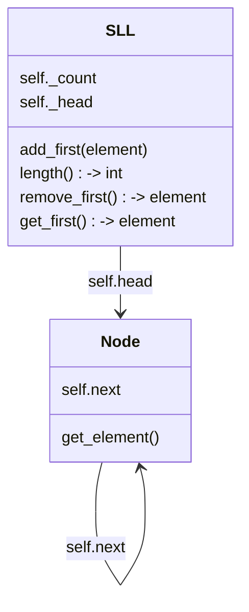
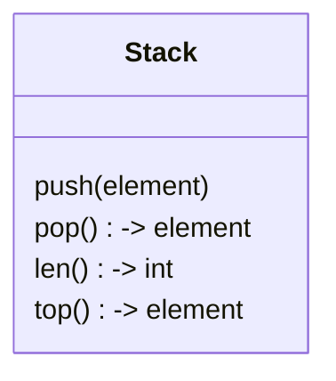
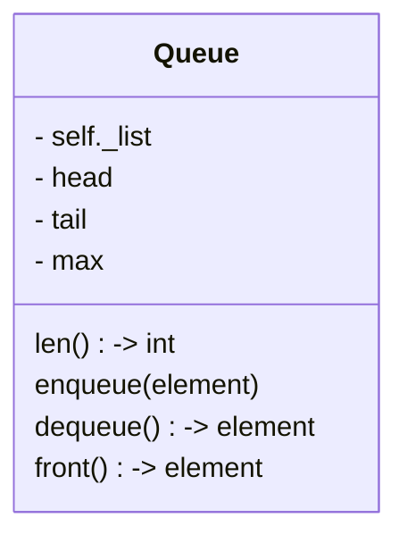
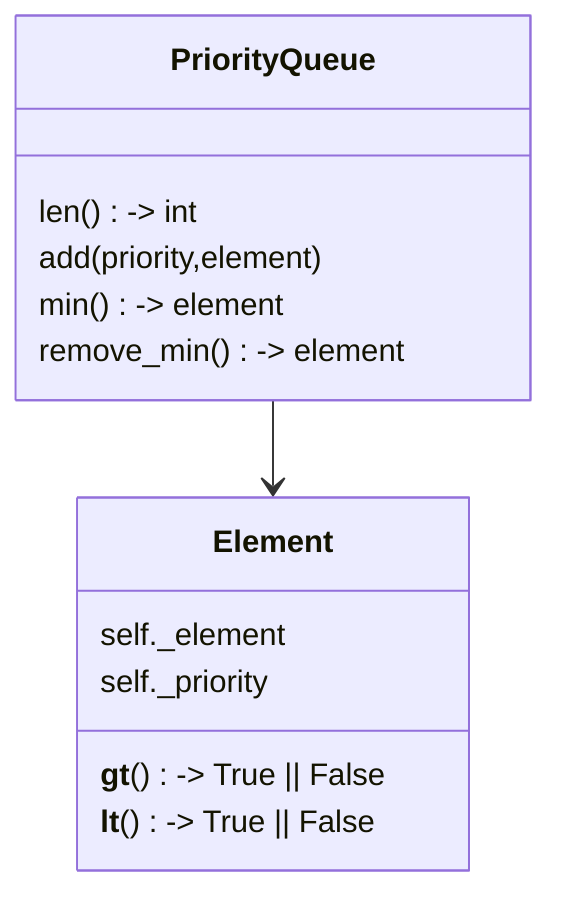

# Introduction
Notes from datastructures and algorithms

# Sequence Mechanisims

## Arrays
An Array is a __contiguous__ sequence of elements.
Elements are identical in size. Elements are accessed
by an index into the array. The location of any Element
is calculated by adding the address of the start of the 
Array to the index times the size of an Element, thus
calculating the location of any element is independent of 
the size of the Array, hence accessing an element is 0(1)

Modifying an element is also 0(1)

Adding a new element is on average 0(1), however,
it becomes 0(n) if we have exhausted the Array's
reserved/buffer.

Removing an Element From the top of the Array is 0(1).
However, removing an element anywhere else is 0(n).
The reason for this is we require to copy elements
left to remove the gap and keep the array contiguous.

## Single Linked List

## Double Linked List
# Abstract Data Types
## Stack ADT

## Queue ADT:

## Priority Queue:

