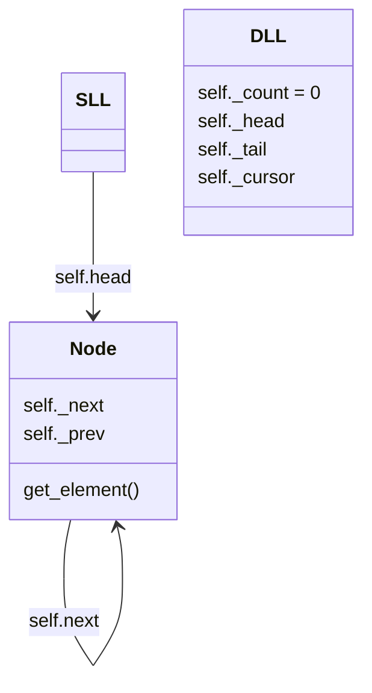
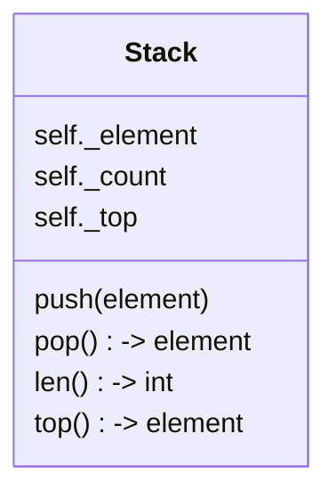

### Explain the implementation of a doubly linked list:
- a doubly linked list is an extension upon the Linked list
    method. Instead of using a pything list(Array) which   
    would naturally have indexing we use Objects called Nodes
    which will in turn allow us to 
  - an implementation of this could be a spotify song list, where
    the user with a cursor can choose the next or last song.
  


```
    self._prev = prev

    def get_prev():
        return self._prev


    def add_after(self,element,in_node):
        next_node = self.get_next()
        new_node = Node(element, in_node, next_node)
        in_node.set_next(next_node)
        next_node.set_before(in_node)
        self._count += 1
    
    def add_before(self,element,in_node)
        prev_node = self.get_prev()
        new_node = Node(element, in_node, prev_node)
        in_node.set_prev(prev_node)
        prev_node.set_next(in_node)
        self._count += 1
        
    def remove(self,node)
        before = node.get_prev()
        next = node.get_next()
        before.set_next(next)
        next.set_prev(before)
        node.set_next(None)
        Node.set_prev(None)
        self._count -= 1
        
```

we can implement a dll as a stack quite simply. we must first
change our remove function to only take off the top as Stacks
are FIFO - First In First Out. 

STACK ADT:


Priority QUEUE ADT:
    remove min
    min 
    len 
    add

    you have element 